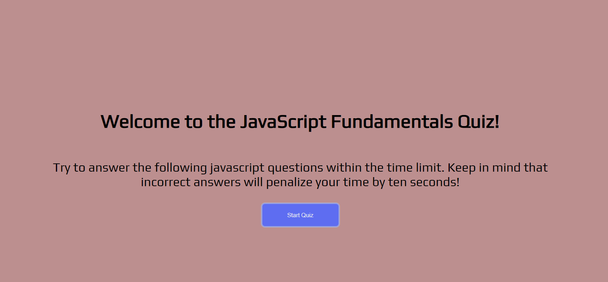

# kirksQuizRepo
# For this assignment we where tasked with creating a JavaScript Quiz that has a timer and duducts for incorrect answers.

;
;

My repo can be reached <a href="https://github.com/kirkh43064/kirksQuizRepo" target="_blank">here</a>

My application can be reached <a href="https://kirkh43064.github.io/kirksQuizRepo/index.html" target="_blank">here</a>